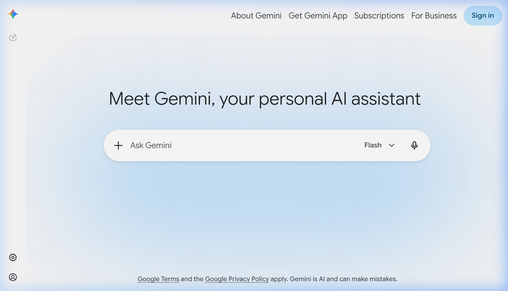
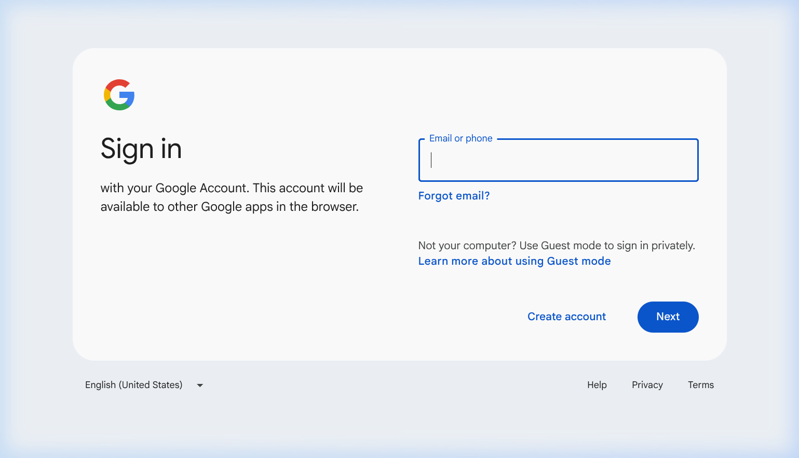
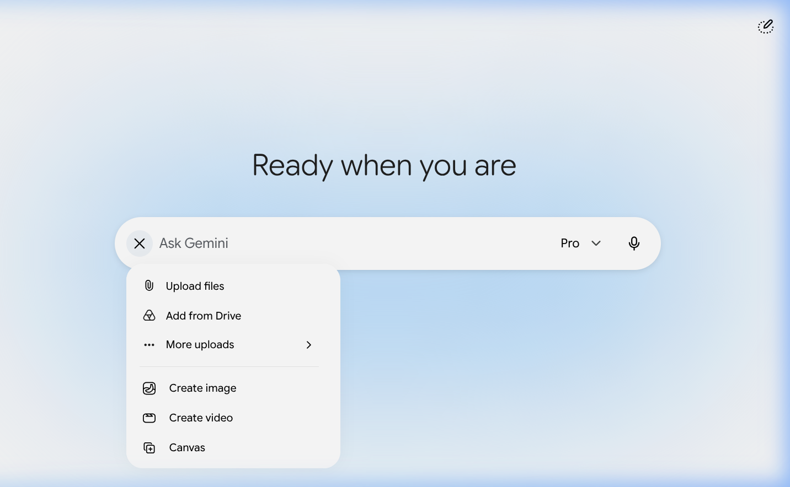
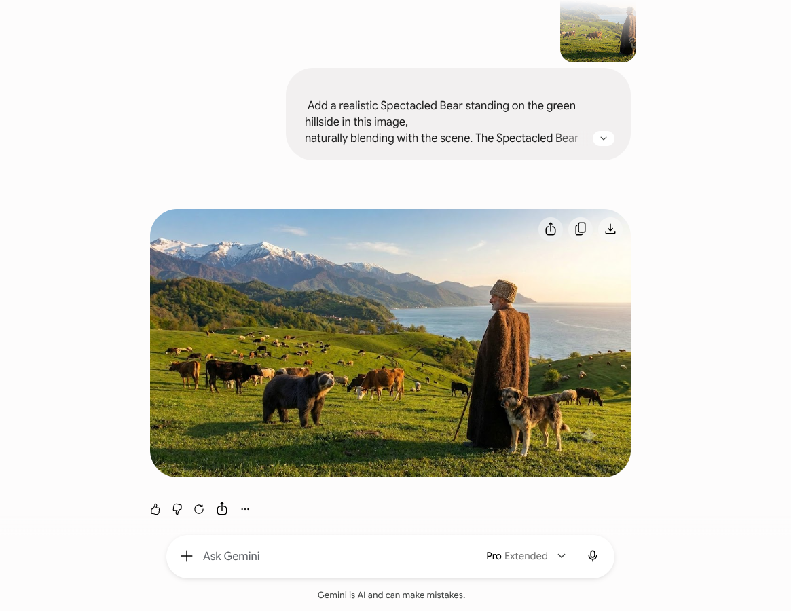
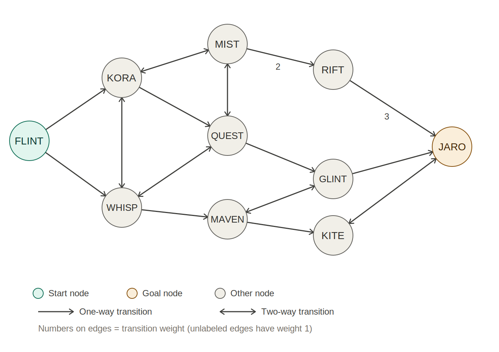

# Final Examination: Introduction to Artificial Intelligence

---

## Task 1: Generative AI Application

---

## Task 2: User Guide — Inserting a Spectacled Bear via Google Gemini

This instructional guide outlines the process of accessing **Google Gemini** and utilizing its image manipulation features to integrate a spectacled bear into a provided landscape.

---

### Prerequisites

*   A modern web browser (such as Edge, Firefox, or Google Chrome).
*   An active internet connection.
*   A Gmail/Google account (which can be created during the login process if needed).
*   The base image downloaded from the following URL: `https://max.ge/ai2026/final/picture-template.jpeg`

---

### Step 1: Accessing the Google Gemini Platform

Launch your browser and navigate to **[https://gemini.google.com](https://gemini.google.com)**. Upon arrival, you will be greeted by the Gemini homepage, which displays a welcome message reading *"Meet Gemini, your personal AI assistant"* alongside a text box labeled *"Ask Gemini"*.

---

### Step 2: Account Authentication or Registration

Locate and click the **"Sign in"** button situated in the upper-right area of the interface to proceed to the Google login screen.

**For Existing Account Holders:**
*   Input your email address or phone number.
*   Hit **"Next"**.
*   Provide your password and click **"Next"** again to complete the login.

**For New Users:**
*   Select **"Create account"** at the bottom left of the sign-in prompt.
*   Pick the **"For my personal use"** option.
*   Provide your first and last name.
*   Enter your gender and date of birth.
*   Select an existing Gmail address or formulate a new one.
*   Establish a secure password.
*   Optionally attach a phone number for account recovery.
*   Agree to the Privacy Policy and Terms of Service provided by Google.

Once authenticated, the system will route you back to the main Gemini chat interface.

---

### Step 3: Uploading the Base Photograph

Now that you are logged into the chat interface, you can upload the image:

1. Click on the **"+"** icon located to the left of the *"Ask Gemini"* prompt bar.
2. This action reveals a dropdown menu containing various options.

3. Select **"Upload files"** from this menu.
4. When your system's file explorer opens, browse for the `picture-template.jpeg` file you saved earlier, highlight it, and select **"Open"**.
5. The picture will now show up as a small preview attached directly to your text input.

---

### Step 4: Formulating the AI Prompt

With your image successfully attached, enter the following command into the *"Ask Gemini"* box:

> **Add a realistic spectacled bear standing on the green hillside in this image, naturally blending with the scene. The bear should be positioned among the grazing cattle, with correct lighting and shadows matching the golden-hour sunlight. Keep everything else unchanged.**

Submit your request by pressing **Enter** on your keyboard or clicking the **Send** (arrow) icon.

---

### Step 5: Assessing and Exporting the Final Image

Gemini will analyze your request and generate the updated image, a process that typically takes between **10 and 30 seconds**. The screenshot provided below illustrates the complete exchange, including the original upload, the typed prompt, the AI's textual reply, and the final visual containing the spectacled bear:

When the finalized image appears in the chat:

1. Place your mouse cursor over the generated picture.
2. Click the **Download** icon (represented by a downward-facing arrow) that overlays the image.
3. Save this new file to your computer's project folder as `task1_bear.png`.

---

### Original Picture

The unmodified baseline photo—depicting a Caucasus mountain landscape complete with grazing cattle, a shepherd, and a dog:

### Final Result (After Adding the Spectacled Bear)

The newly generated image featuring the seamlessly integrated spectacled bear, processed via Google Gemini:

---

### Summary

| Step | Action |
| :--- | :--- |
| 1 | Go to [gemini.google.com](https://gemini.google.com) |
| 2 | Authenticate your Google credentials or register a new profile |
| 3 | Tap **"+"** → choose **"Upload files"** → upload the base picture |
| 4 | Enter the prompt instructing Gemini to insert a spectacled bear |
| 5 | Download your finalized image |

---

## Task 3: Finding the Graph

The chatbot at the provided URL defines a state graph with 10 nodes and 15 transitions, starting at node `FLINT` and ending at goal node `JARO`. The diagram below includes every reachable node and every transition, distinguishing one-way transitions (single arrow) from two-way transitions (arrows on both ends), with transition weights labeled where they differ from the default of 1.

